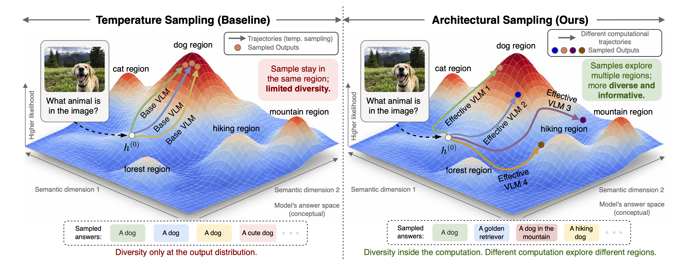

# Architectural Sampling: Test-Time Scaling via Computational Diversity in Frozen Vision-Language Models

## 1. Introduction

<!-- FIGURE: method overview. Drop the image at figures/method_overview.png -->
<p align="center">
  
  <br/>
  <em>Two sources of candidate diversity. Temperature sampling (left) draws several outputs from the same computation path. Architectural sampling (right) changes the computation path itself, starting from the same multimodal representation h<sup>(0)</sup>, and produces one candidate per path. The landscape is a conceptual illustration of the answer space</em>
</p>

<p align="center">
  <a href="https://akshit21112002.github.io/Architectural-Sampling/">
    
  </a>
  &nbsp;&nbsp;
  <a href="https://arxiv.org/abs/2610.01687">
    
  </a>
</p>

<p align="center">
  <em>For further details, please visit the project page or read the full paper on arXiv.</em>
</p>


## 2. Environment

Tested with **torch 2.5.1+cu121**.

```
transformers 4.57.0   ->  Qwen2.5-VL, Qwen3-VL   (default environment)
transformers 5.16.1   ->  Qwen3.5-VL             (same env, upgrade only)
```

Create the environment, activate it, then install everything with the helper
script:

```bash
# 1. create the environment (Python 3.10)
conda create -y -n rvd python=3.10

# 2. activate it 
conda activate rvd

# 3. install torch 2.5.1+cu121, transformers 4.57.0 and the other deps
bash setup_env.sh
```

`setup_env.sh` installs into the **currently active** environment (torch,
transformers 4.57.0, accelerate, datasets, pillow, matplotlib, peft) and prints
a torch/CUDA/transformers sanity check at the end.

### Qwen3.5-VL (upgrade only — no new env)

Keep the same environment and bump transformers:

```bash
pip install -U "transformers==5.16.1"
```

> **Qwen3.5-VL note — `enable_thinking=False`.** Qwen3.5 has a *thinking* mode; for
> these short-answer evals you want it **off**. Each eval script marks the exact
> spot in `_build_inputs` (the `processor.apply_chat_template(...)` call). Add
> `enable_thinking=False,` there **only** for Qwen3.5 — it is a Qwen3.5 flag and
> will error on Qwen2.5 / Qwen3, so leave it out for those models.

### Selecting the model (top of each eval script)

For Files: mcq_bon.py, count_bon.py, realworldqa_bon.py


Uncomment **exactly one** RVD backend:

```python
import rvd_qwen_2_5_evo as rvd     # Qwen2.5-VL
# import rvd_qwen_3_evo   as rvd   # Qwen3-VL
# import rvd_qwen_3_5_evo as rvd   # Qwen3.5-VL  (needs transformers 5.16.1)
```

---

## 3. Data

Download and normalize every benchmark **once, on a machine with internet** then copy the output folders to the cluster. `download_datasets.py`
writes each dataset with `save_to_disk`, in the exact schema its eval script reads:

```bash
# everything into ./vlm_data/<name>
python download_mcq_datasets.py --all --out_root ./vlm_data

# or a subset (any mix of numeric / MCQ / verifiable)
python download_mcq_datasets.py --datasets cvbench countbench realworldqa --out_root ./vlm_data

# cap samples per dataset while downloading
python download_mcq_datasets.py --datasets ai2d --limit 2638 --out_root ./vlm_data
```

---

## 4. Experiments

Each eval loads a model once, then for every search variation re-patches the RVD
backend with a new `(K, block_start, block_end)`, decodes, and scores. It writes a
`.txt` report and a best-of-n curve `.png`.

Shared flags: `--model`, `--dataset_dir`, `--max_samples`, `--K_eval`,
`--block_min/--block_max/--block_window`, `--temp` (baseline temperature),
`--skip_temp_bon`, `--output`, `--plot_output`, `--lora_dir`, `--verbose`.

### 4.1 Multiple choice (CV-Bench / AI2D / MMMU / …)

```bash
python mcq_bon.py \
    --model /path/to/Qwen2.5-VL-7B-Instruct \
    --dataset_dir ./vlm_data/cvbench \
    --max_samples 5000 \
    --K_eval 1 2 4 \
    --block_min 0 --block_max 5 --block_window 3 --temp 0.6 \
    --output results/mcq_cvbench_bon.txt \
    --plot_output results/mcq_cvbench_bon.png
```

Swap `--dataset_dir` to `./vlm_data/ai2d`, `./vlm_data/mmmu`, etc. to run the
other MCQ sets with the same command.

### 4.2 Open-ended numeric (CountBenchQA / CountQA)

```bash
python count_bon.py \
    --model /path/to/Qwen2.5-VL-7B-Instruct \
    --dataset_dir ./vlm_data/countbench \
    --max_samples 5000 \
    --K_eval 1 2 4 \
    --block_min 0 --block_max 5 --block_window 3 \
    --score_metric relerr \
    --output results/count_countbench_bon.txt \
    --plot_output results/count_countbench_bon.png
```

`--score_metric`: `relerr` (default), `ratio`, or `abs` (exact match).

### 4.3 Verifiable free-form (RealWorldQA)

```bash
python realworldqa_bon.py \
    --model /path/to/Qwen2.5-VL-7B-Instruct \
    --dataset_dir ./vlm_data/realworldqa \
    --max_samples 5000 \
    --K_eval 1 2 4 --block_min 0 --block_max 5 --block_window 3 \
    --max_new_tokens 256 \
    --output results/realworldqa_bon.txt \
    --plot_output results/realworldqa_bon.png
```

### 4.4 Ablation: which tokens to evolve

The recurrent-refinement variant is chosen by `EVOLUTION_MODE`, set once at the
**top of each `rvd_qwen_*_evo.py` file**. It controls *which* token positions the recurrent
block iterates on. To run an ablation,
change this one line and re-run the same eval command:

```python
# top of rvd_qwen_2_5_evo.py / rvd_qwen_3_evo.py / rvd_qwen_3_5_evo.py
EVOLUTION_MODE = "all"      # <- change this to ablate which tokens are evolved
```

| `EVOLUTION_MODE` | Tokens iterated 
|---|---|
| `"vision"` | vision only (text frozen) |
| `"all"` | vision + text | 
| `"language"` | text only (vision frozen) | 
| `"vision_average"` | vision only | 
| `"none"` | — | 


### Switching model — checklist

1. Edit the RVD import at the top of the script (Section 2).
2. Moving **to** Qwen3.5: `pip install -U "transformers==5.16.1"` and add
   `enable_thinking=False,` in `_build_inputs`.
3. Moving **back** to Qwen2.5 / Qwen3: `pip install "transformers==4.57.0"` and
   remove `enable_thinking=False,`.
4. Point `--model` at the matching weights.

---

## 5. Results

<!-- FIGURE: best-of-n curves. Drop the image at figures/results_curves.png -->
<p align="center">
  
  <br/>
  <em>Architectural sampling vs Temperature Sampling </em>
</p>

All runs wuth their `.txt` reports and `.png` curves are present int the **`results/`**
folder. **open that folder to
see the per-dataset logs and best-of-n curves.**

---

